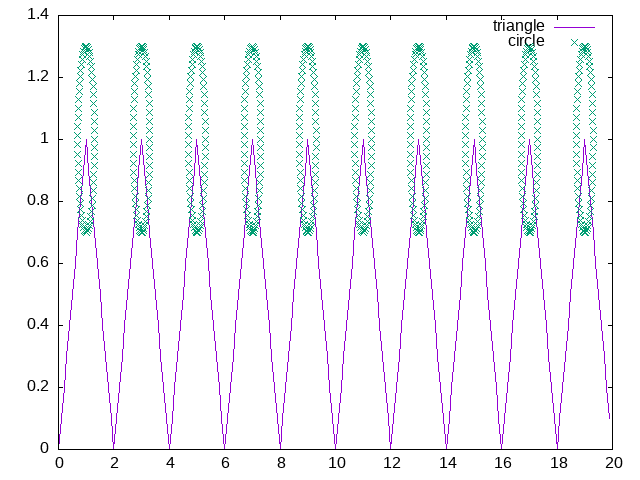
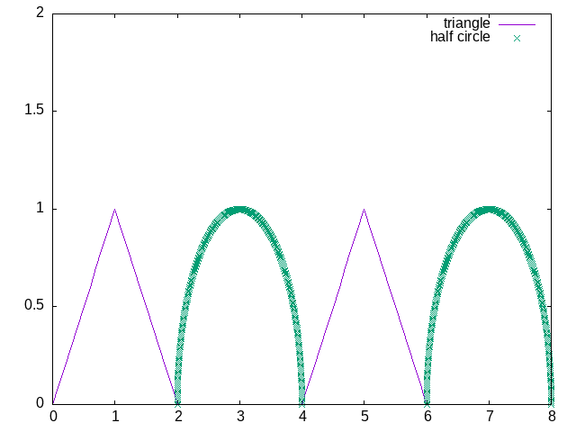

Most probable is about plotting periodic functions, given sample figures as question

some examples,

------------------------------------------------------------------------
### tip - look up Manpages
------------------------------------------------------------------------

    man 3 math.h
    man 3 complex.h

almost all common operations will have a builtin functions, it's
futile effort to recreate those instead try to figure with manpages

1. built value for all multiples of pi  <math.h> 

       M_E         Value of e
       M_LOG2E     Value of log_2 e
       M_LOG10E    Value of log_10 e
       M_LN2       Value of log_e 2
       M_LN10      Value of log_e 10
       M_PI        Value of π
       M_PI_2      Value of π/2
       M_PI_4      Value of π/4
       M_1_PI      Value of 1/π
       M_2_PI      Value of 2/π
       M_2_SQRTPI  Value of 2/√π
       M_SQRT2     Value of √2
       M_SQRT1_2   Value of 1/√2

2. reminder function with fmodf()         <math.h>

       If x or y is a NaN, a NaN is returned.
       If x is an infinity, a domain error occurs, and a NaN is returned.
       If y is zero, a domain error occurs, and a NaN is returned.
       If x is +0 (-0), and y is not zero, +0 (-0) is returned.

3. ceil() , floor() for rounding off    <math.h>

       These  functions  return  the  smallest integral value that is not less
       than x.
       For example, ceil(0.5) is 1.0, and ceil(-0.5) is 0.0.

       These functions return the largest integral value that is  not  greater
       than x.
       For example, floor(0.5) is 0.0, and floor(-0.5) is -1.0.

4. complex numbers                      <complex.h>

       I           Expands to either _Imaginary_I or  _Complex_I.  If  _Imagi‐
                   nary_I is not defined, I expands to _Complex_I.

       z = creal(z) + I * cimag(z)

----------------------------------------------------------------------------

The above 2 figures are created using these builtin functions, having
an idea of how to find these and recreate will help you solve problems 
on test. 
